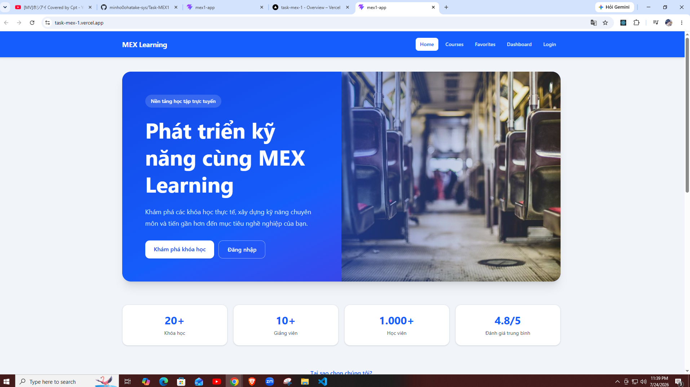
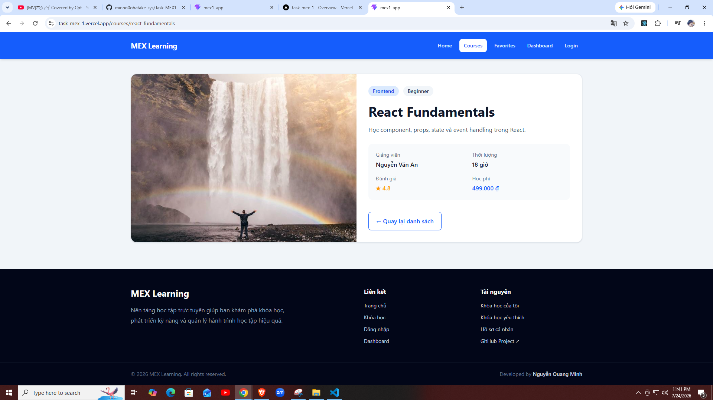
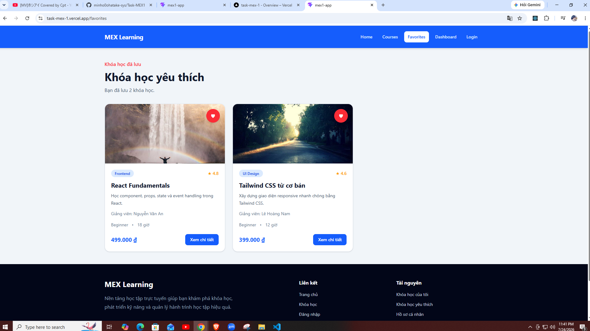
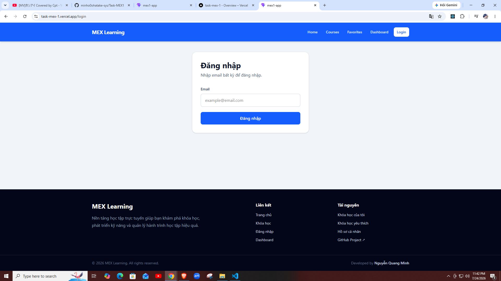
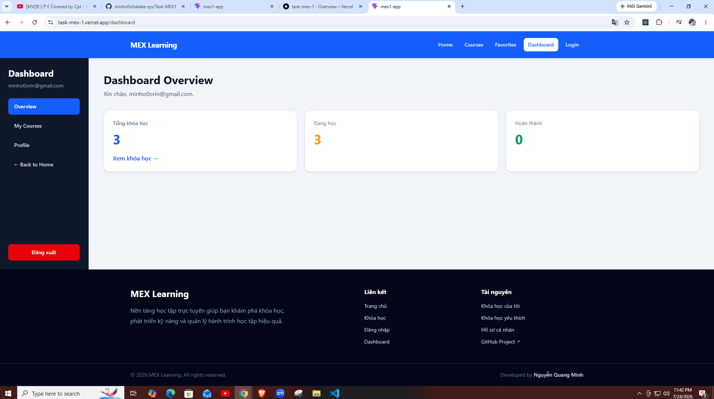
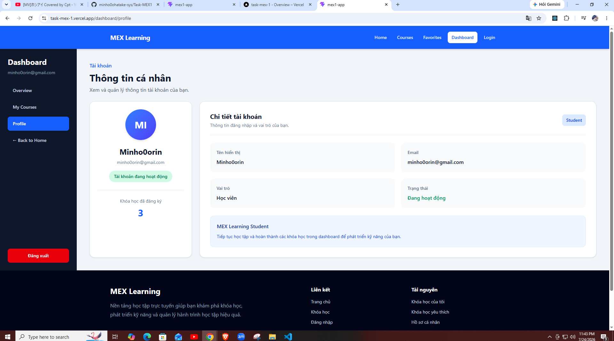

# MEX Learning

MEX Learning là ứng dụng Mini Learning Management System được xây dựng bằng React và TypeScript. Project mô phỏng quy trình khám phá khóa học, xem chi tiết, lưu khóa học yêu thích, đăng nhập và quản lý khóa học cá nhân trong dashboard.

## Live Demo

- **Website:** [Link Demo](https://task-mex-1.vercel.app/)
- **GitHub:** [Task MEX1](https://github.com/minho0ohatake-sys/Task-MEX1)

## Screenshots

### Home Page

Trang chủ giới thiệu nền tảng, tính năng nổi bật và lời kêu gọi khám phá khóa học.



### Courses Page

Danh sách khóa học với thông tin giảng viên, trình độ, thời lượng, học phí và nút yêu thích.


### Course Detail Page

Trang hiển thị thông tin chi tiết của một khóa học.



### Favorites Page

Danh sách khóa học được người dùng lưu vào Favorites.



### Login Page

Giao diện đăng nhập giả lập bằng email.



### Dashboard Page

Trang tổng quan hiển thị thông tin và thống kê khóa học của người dùng.



### My Courses Page

Danh sách các khóa học người dùng đã đăng ký.


### Profile Page

Trang hiển thị thông tin tài khoản và số lượng khóa học của người dùng.



## Features

### Public

- Hiển thị danh sách khóa học.
- Xem thông tin chi tiết khóa học.
- Dynamic route `/courses/:id`.
- Tìm khóa học theo ID trên URL.
- Xử lý khóa học không tồn tại.
- Thêm và xóa khóa học yêu thích.
- Lưu Favorites bằng `localStorage`.
- Không mất danh sách yêu thích khi tải lại trang.
- Trang 404 cho URL không tồn tại.

### Authentication

- Đăng nhập giả lập bằng email.
- Đăng xuất tài khoản.
- Bảo vệ dashboard bằng Private Route.
- Chuyển hướng người dùng chưa đăng nhập về `/login`.

### Dashboard

- Dashboard tổng quan.
- Hiển thị thông tin người dùng.
- Hiển thị số lượng khóa học đã đăng ký.
- Trang My Courses.
- Trang Profile.
- Nested routing trong Dashboard Layout.
- Sidebar có trạng thái active bằng `NavLink`.

### State Management

- Quản lý authentication bằng Redux Toolkit.
- Quản lý danh sách khóa học bằng Redux Toolkit.
- Quản lý Favorites bằng Redux Toolkit.
- Sử dụng typed Redux hooks.
- Sử dụng memoized selector với `createSelector`.
- Load dữ liệu bất đồng bộ bằng `createAsyncThunk`.
- Hỗ trợ loading, success, empty và error states.
- Mô phỏng lỗi tải dữ liệu và chức năng thử lại.

### UI/UX

- Giao diện responsive trên mobile, tablet và desktop.
- Landing page với Hero Section, thống kê và CTA.
- Course Card có nút yêu thích.
- Header và Footer dùng chung.
- Dashboard Layout riêng với sidebar.
- Nút đăng nhập có trạng thái disabled.
- Loading spinner và thông báo lỗi rõ ràng.

## Tech Stack

- React
- TypeScript
- Vite
- React Router
- Redux Toolkit
- React Redux
- Tailwind CSS
- HTML5
- Local Storage
- Git
- GitHub
- GitLab
- Vercel

## Project Structure

```text
src/
├── components/
│   ├── auth/
│   │   └── PrivateRoute.tsx
│   ├── course/
│   │   ├── CourseCard.tsx
│   │   ├── CourseDetail.tsx
│   │   └── CourseList.tsx
│   ├── Footer.tsx
│   └── Header.tsx
├── data/
│   └── courses.ts
├── features/
│   ├── auth/
│   │   └── authSlice.ts
│   ├── courses/
│   │   ├── courseSelectors.ts
│   │   └── coursesSlice.ts
│   └── favorites/
│       ├── favoriteSelectors.ts
│       └── favoritesSlice.ts
├── layouts/
│   ├── DashboardLayout.tsx
│   └── MainLayout.tsx
├── pages/
│   ├── CourseDetailPage.tsx
│   ├── CoursesPage.tsx
│   ├── DashboardPage.tsx
│   ├── FavoritesPage.tsx
│   ├── HomePage.tsx
│   ├── LoginPage.tsx
│   ├── MyCoursesPage.tsx
│   ├── NotFoundPage.tsx
│   └── ProfilePage.tsx
├── store/
│   ├── hooks.ts
│   └── store.ts
├── types/
│   └── course.ts
├── App.tsx
├── index.css
└── main.tsx
```

## Routes

| Route | Access | Description |
|---|---|---|
| `/` | Public | Trang chủ |
| `/courses` | Public | Danh sách khóa học |
| `/courses/:id` | Public | Chi tiết khóa học |
| `/favorites` | Public | Khóa học yêu thích |
| `/login` | Public | Đăng nhập |
| `/dashboard` | Private | Dashboard tổng quan |
| `/dashboard/my-courses` | Private | Khóa học của người dùng |
| `/dashboard/profile` | Private | Hồ sơ người dùng |
| `*` | Public | Trang 404 |

## Installation

Clone repository:

```bash
git clone https://github.com/minho0ohatake-sys/Task-MEX1.git
```

Di chuyển vào thư mục project:

```bash
cd Task-MEX1
```

Cài đặt dependencies:

```bash
npm install
```

## Run Development Server

```bash
npm run dev
```

Mở trình duyệt tại:

```text
http://localhost:5173
```

## Build

Tạo production build:

```bash
npm run build
```

Kiểm tra production build:

```bash
npm run preview
```

Địa chỉ preview mặc định:

```text
http://localhost:4173
```

## Authentication

Project sử dụng chức năng đăng nhập giả lập, không kết nối API authentication thật.

Để đăng nhập:

1. Truy cập `/login`.
2. Nhập một địa chỉ email hợp lệ.
3. Nhấn **Đăng nhập**.
4. Ứng dụng chuyển đến `/dashboard`.

Sau khi đăng xuất, người dùng không thể truy cập các private route trong dashboard.

## Favorites

Người dùng có thể nhấn biểu tượng trái tim trên Course Card để thêm hoặc xóa khóa học yêu thích.

Danh sách ID khóa học yêu thích được lưu trong `localStorage` với key:

```text
mex-learning-favorites
```

Vì vậy danh sách Favorites không bị mất khi tải lại trình duyệt.

## Async Data Flow

Course data được tải bất đồng bộ bằng mock Promise và Redux Toolkit:

```text
UI
→ dispatch(fetchCourses())
→ createAsyncThunk
→ pending
→ fulfilled hoặc rejected
→ reducer cập nhật state
→ UI render lại
```

Không sử dụng API thật trong project này.

## Deployment

Project được chuẩn bị để deploy trên Vercel.

Build command:

```bash
npm run build
```

Output directory:

```text
dist
```

File `vercel.json` xử lý React Router khi tải lại dynamic route:

```json
{
  "rewrites": [
    {
      "source": "/(.*)",
      "destination": "/index.html"
    }
  ]
}
```

## Author

**Nguyễn Quang Minh**

Frontend Developer

- GitHub: [minho0ohatake-sys](https://github.com/minho0ohatake-sys)
- Project: [Task MEX1](https://github.com/minho0ohatake-sys/Task-MEX1)

## License

Project được xây dựng cho mục đích học tập và portfolio.